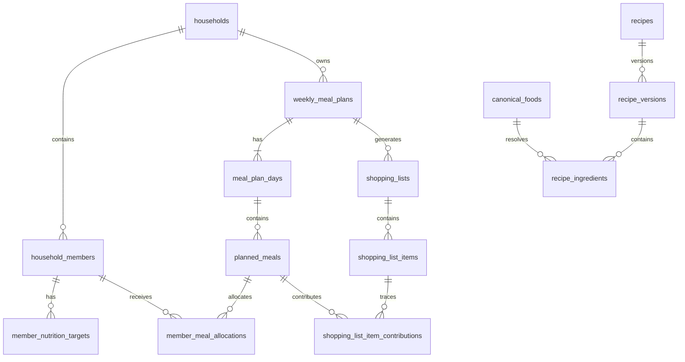

# ADR-0071: Household-Aware Weekly Menu and Shopping Domain

Status: Proposed

Date: 2026-07-02

## Context

HealBite already has a Telegram rich reply keyboard. Three visible entries are
currently safe placeholders and are the intended entry points for the next
product surface:

- `📋 Меню на неделю` -> `__placeholder__:weekly_menu`
- `🛒 Список покупок` -> `__placeholder__:shopping_list`
- `👨‍👩‍👧 Семья` -> `__placeholder__:family`

The existing working sections remain member-scoped:

- `👤 Мой профиль` -> `/profile`
- `🍎 Дневник еды` -> `/diary`
- `⚖️ Трекер веса` -> `/weight`
- `💧 Трекер воды` -> `/water`
- `📈 Отчет за неделю` -> `/stats 7d`

The keyboard is a `ReplyKeyboardMarkup` text-route menu in
`gateway/platforms/telegram.py`. Sprint 7.1A is intentionally documentation
only. It does not change handlers, callbacks, schema, prompt builders, Docker,
or production state.

## Decision

Model every HealBite user as a household with one primary member. Weekly menus,
shopping lists, recipes, and future family profiles are household-scoped, while
food diary, water, weight, and current nutrition targets remain member-scoped.

This gives a stable path from a single-user weekly menu MVP to shared family
planning without tying future domain tables directly to Telegram account IDs.

## Identity Boundaries

| Identity | Purpose | Notes |
| --- | --- | --- |
| Telegram user | Transport identity and private-chat delivery | Not a domain owner by itself |
| Application user | Existing authenticated HealBite account | Owns or joins households |
| Household | Authorization and shared planning boundary | Owns plans, lists, members |
| Household member | Nutrition target and portion subject | May be linked or unlinked |
| Dependent sub-profile | Minimal-data member managed by an adult | Does not require Telegram |

`telegram_user_id` must not be the primary key for `household_member`. Linked
members may have a nullable `linked_user_id`, but unlinked adults and dependent
profiles must remain representable.

## Domain Boundary

Household owns household members, roles, weekly meal plans, shopping lists,
shared recipes, and household-scoped access checks.

Member owns nutrition targets, planned portion allocations, consumed nutrition
diary records, weight history, water history, and member-specific weekly report
views.

## Existing Feature Integration

The existing profile is the source for the primary member. New weekly plan code
must not create a second independent profile. Nutrition targets are read through
a versioned member target snapshot when a plan is generated.

The food diary remains actual consumed food. Weekly menu entries are planned
food. Opening or generating a menu must not write to `nutrition_log`. A future
explicit action may copy a planned meal into the diary after user confirmation.

Weight and water tracking stay member-scoped. No household aggregate weight or
water metric is required for the weekly menu MVP.

The current weekly report remains member-scoped initially. A future report can
compare planned nutrition versus actual consumed nutrition, but that is outside
Sprint 7.1A and must not change current report behavior.

## Proposed Additive Schema

The following DDL is a design contract only. It is not a migration script.

```sql
CREATE TABLE households (
  id TEXT PRIMARY KEY,
  owner_user_id TEXT NOT NULL,
  name TEXT NOT NULL,
  status TEXT NOT NULL,
  default_timezone TEXT NOT NULL,
  created_at TEXT NOT NULL,
  updated_at TEXT NOT NULL,
  version INTEGER NOT NULL DEFAULT 1
);

CREATE TABLE household_members (
  id TEXT PRIMARY KEY,
  household_id TEXT NOT NULL,
  linked_user_id TEXT NULL,
  display_name TEXT NOT NULL,
  member_type TEXT NOT NULL,
  role TEXT NOT NULL,
  status TEXT NOT NULL,
  age_band TEXT NULL,
  created_at TEXT NOT NULL,
  updated_at TEXT NOT NULL,
  version INTEGER NOT NULL DEFAULT 1,
  FOREIGN KEY (household_id) REFERENCES households(id)
);

CREATE TABLE member_nutrition_targets (
  id TEXT PRIMARY KEY,
  household_member_id TEXT NOT NULL,
  effective_from TEXT NOT NULL,
  effective_to TEXT NULL,
  calorie_target INTEGER NULL,
  protein_target REAL NULL,
  fat_target REAL NULL,
  carb_target REAL NULL,
  goal_type TEXT NULL,
  source TEXT NOT NULL,
  version INTEGER NOT NULL DEFAULT 1,
  created_at TEXT NOT NULL,
  FOREIGN KEY (household_member_id) REFERENCES household_members(id)
);
```

## Entity Relationship Overview



## Permission Model

Roles:

- `owner`
- `adult_admin`
- `adult_member`
- `dependent`

| Operation | owner | adult_admin | adult_member | dependent |
| --- | --- | --- | --- | --- |
| View household | yes | yes | yes | limited |
| Add member | yes | yes | no | no |
| Edit member | yes | yes | self only | no |
| Edit nutrition target | yes | yes | self only | no |
| Generate weekly plan | yes | yes | yes | no |
| Replace planned meal | yes | yes | yes | no |
| View shopping list | yes | yes | yes | limited |
| Edit shopping list | yes | yes | yes | no |
| Link Telegram account | yes | yes | self only | no |
| Disable member | yes | yes | no | no |
| Transfer ownership | yes | no | no | no |

All service and store calls must verify household boundary before reading or
mutating household-scoped state.

## Alternatives Considered

### User-only weekly plans

Rejected. A schema keyed directly by application user or Telegram user would
need disruptive changes when family profiles arrive.

### Family profiles as independent user profiles

Rejected. It creates duplicate profile concepts and breaks target snapshots,
portion allocation, and permission boundaries.

### Shopping list as free text only

Rejected. Free text cannot support deterministic aggregation, manual overlay,
traceability, or refresh semantics.

### LLM as nutrition source of truth

Rejected. LLM may propose meals and recipes, but deterministic validation and
nutrition calculation own final KBJU, portions, quantities, and persistence.

## Consequences

Positive:

- single-user MVP and household expansion share the same model;
- current Telegram menu can be reused without label changes;
- profile, diary, weight, water, and reports keep their existing boundaries;
- shopping refresh can preserve manual edits;
- permissions are explicit from the first implementation sprint.

Costs:

- more schema than a single-user-only MVP;
- requires target snapshots and recipe versioning;
- requires idempotency, optimistic versions, and generation leases;
- requires careful privacy classification for household data.

## Docs-Only Scope Gate

```text
production code changed=false
Telegram keyboard changed=false
button labels changed=false
callback data changed=false
runtime handlers changed=false
schema changed=false
migration added=false
LLM runtime changed=false
Docker/Compose changed=false
production DB changed=false
build performed=false
deploy performed=false
restart performed=false
```
