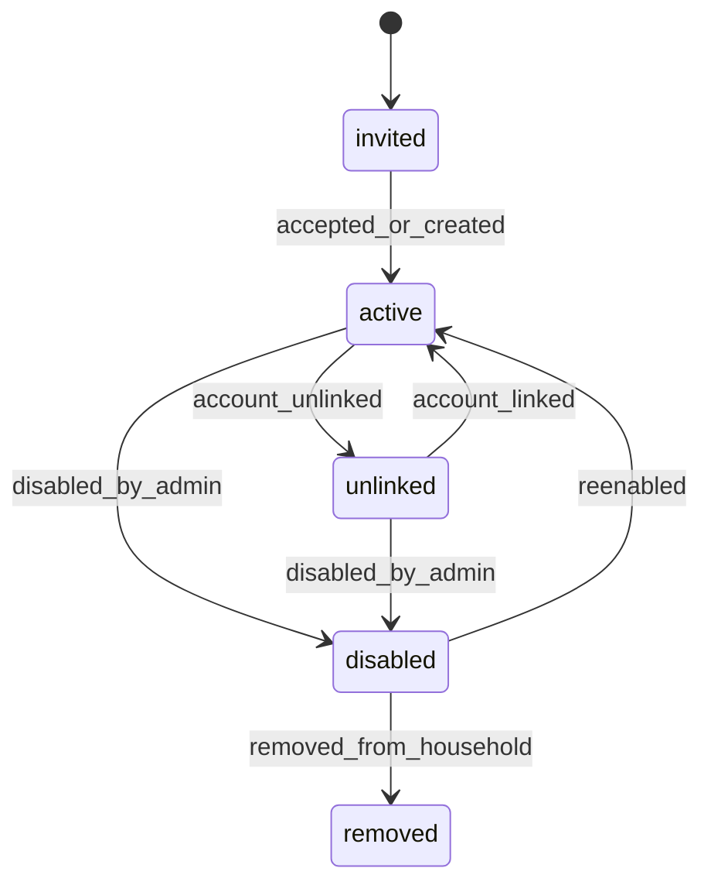

# HealBite Household and Sub-Profile Design

Status: design-only proposal

## Purpose

The `👨‍👩‍👧 Семья` menu entry should become household management without
redefining Telegram groups, bot admins, or contact lists as product households.

## Household

Proposed fields:

```text
id
owner_user_id
name
status
default_timezone
created_at
updated_at
version
```

Household is the ownership and authorization boundary for weekly plans,
shopping lists, members, and shared recipes.

## Household Member

Proposed fields:

```text
id
household_id
linked_user_id nullable
display_name
member_type
role
status
age_band nullable
created_at
updated_at
version
```

`age_band` is preferred over full birth date unless exact date is required by a
future product decision. Dependent profiles should minimize personal data.

Member types:

```text
primary_linked_member
linked_adult
unlinked_adult_subprofile
dependent_child_profile
```

Roles:

```text
owner
adult_admin
adult_member
dependent
```

Statuses:

```text
invited
active
unlinked
disabled
removed
```

## Member State Machine



## Nutrition Target

Nutrition target belongs to household member, not directly to household.

```text
id
household_member_id
effective_from
effective_to nullable
calorie_target
protein_target
fat_target
carb_target
goal_type
source
version
created_at
```

Weekly plans store target snapshot versions. A historical plan does not change
because a member edits targets later.

## Dietary Restrictions

| Type | Validation |
| --- | --- |
| hard allergy | deterministic blocker |
| medical restriction | deterministic blocker or warning by rule |
| religious/ethical restriction | deterministic blocker |
| strong dislike | ranking and retry signal |
| soft preference | ranking signal |

Allergies and medical restrictions must never be treated as optional prompt
preferences.

## Permission Matrix

| Capability | owner | adult_admin | adult_member | dependent |
| --- | --- | --- | --- | --- |
| View household | yes | yes | yes | limited |
| Add member | yes | yes | no | no |
| Edit own profile | yes | yes | yes | no |
| Edit dependent profile | yes | yes | no | no |
| Edit nutrition target | yes | yes | self only | no |
| Edit hard restrictions | yes | yes | self only | no |
| Generate weekly plan | yes | yes | yes | no |
| Replace planned meal | yes | yes | yes | no |
| View shopping list | yes | yes | yes | limited |
| Edit shopping list | yes | yes | yes | no |
| Link Telegram account | yes | yes | self only | no |
| Disable member | yes | yes | no | no |
| Transfer ownership | yes | no | no | no |

## Existing User Bootstrap

Phase 1 migration should create a one-member household for each existing
application user. The member is the primary linked member. Existing nutrition,
weight, water, and diary records remain in their existing tables and are not
moved.

Bootstrap must be additive, idempotent, rehearsable on a production-derived DB
copy, safe to re-run, independent of Telegram username, and free of destructive
updates.

## Future Family Screen

The existing `👨‍👩‍👧 Семья` entry should open household members, add profile,
edit profile, nutrition target, dietary restrictions, permissions, link
Telegram account, disable profile, and back actions.

## Privacy

Do not log member names, dependent details, allergies, medical restrictions,
exact targets, raw callback payloads, or raw exception bodies.

Allowed safe aggregates:

```text
household_size_bucket
member_type
role
status
restriction_count_bucket
permission_result
error_type
```

## Open Product Decisions and Defaults

| Decision | Recommended default |
| --- | --- |
| child age representation | age band, not full birth date |
| linked adult permissions | adult member self-edit plus shared list edit |
| household owner transfer | owner-only explicit confirmation |
| dependent visibility | limited and adult-managed |
| family plan default | include active members only |
| member deletion | disable first, hard deletion deferred |
| exact allergy language | structured categories plus optional user-facing note |
