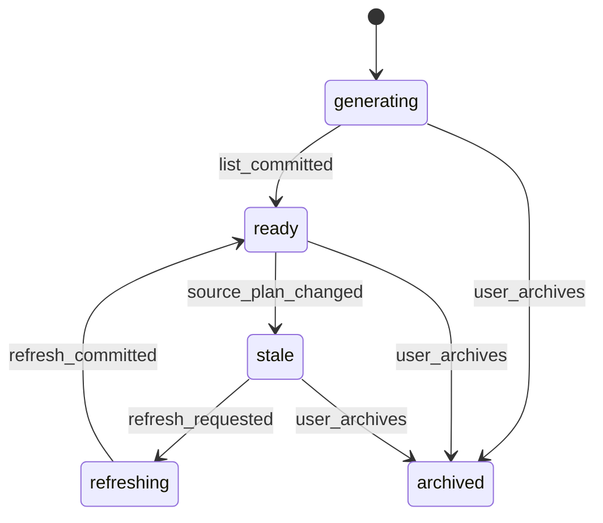

# HealBite Shopping List Data Contracts

Status: design-only proposal

## Scope

The shopping list is generated from a ready weekly plan and may also support
manual-only usage. This document defines contracts only; it does not add schema
or runtime code.

## Shopping List

Proposed fields:

```text
id
household_id
weekly_plan_id nullable
status
generation_version
source_plan_version
created_at
updated_at
version
```

Statuses:

```text
generating
ready
stale
refreshing
archived
```

## Shopping List Item

Proposed fields:

```text
id
shopping_list_id
canonical_food_id nullable
display_name
normalized_quantity
normalized_unit
category
source_type
checked
excluded
manual_quantity_override
manual_name_override
created_at
updated_at
version
```

`source_type` values:

```text
generated
manual_addition
manual_override
```

## Shopping List Item Contribution

Traceability from list quantity back to plan content:

```text
id
shopping_list_item_id
planned_meal_id nullable
recipe_ingredient_id nullable
household_member_id nullable
source_quantity
source_unit
normalized_quantity
normalized_unit
conversion_method
created_at
```

Contributions allow a user to understand why an item appears and let refresh
preserve manual overlays.

## Manual Overlay Contract

The list must separate generated base, manual additions, manual quantity
overrides, manual name overrides, excluded generated items, and checked state.

Refresh from a weekly plan must not erase manual additions, overrides, excluded
state, or checked state unless the user explicitly clears them.

Stable identity must not rely only on display text. Use canonical food where
available plus list item identity and contribution trace.

## Normalization Contract

Canonical dimensions:

```text
mass: mg, g, kg
volume: ml, l
count: piece
```

Volume must not be converted to mass without density. Conversion must store
source quantity, source unit, normalized quantity, normalized unit, conversion
method, and confidence. Low-confidence products must not be merged automatically.

## Refresh Algorithm

Recommended sequence:

1. load ready plan and recipe versions;
2. expand ingredients by member allocations;
3. normalize quantities;
4. group only high-confidence equivalent items;
5. apply existing exclusions;
6. apply manual quantity/name overrides;
7. preserve manual additions;
8. preserve checked state where stable item identity matches;
9. mark stale or ready atomically.

No LLM call is needed for ordinary refresh.

## State Machine



## UI Behavior

The existing `🛒 Список покупок` route should eventually open the active list.
If no ready weekly plan exists, recommendation is to open a manual-only list and
show a clear action to create a weekly menu. This avoids blocking manual
shopping use while keeping generated refresh explicit.

Suggested actions:

- open active list;
- refresh from weekly menu;
- add item;
- check or uncheck item;
- exclude generated item;
- clear checked state;
- back.

## Privacy and Observability

Do not log item names, recipe names, quantities, household member names,
callback payloads, or raw exception bodies.

Allowed markers:

```text
route=shopping_list
shopping_item_count_bucket
manual_overlay_count_bucket
normalization_warning_count
refresh_status
error_type
```

## Proposed Indexes and Constraints

```sql
CREATE INDEX shopping_list_household_status
ON shopping_lists(household_id, status);

CREATE INDEX shopping_item_list_category
ON shopping_list_items(shopping_list_id, category);

CREATE INDEX shopping_contribution_item
ON shopping_list_item_contributions(shopping_list_item_id);
```

## Shopping Test Matrix

| Scenario | Expected result |
| --- | --- |
| ready plan exists | opens generated list |
| no plan exists | opens manual-only list with create-menu action |
| refresh after meal replacement | generated quantities update |
| manual addition exists | retained after refresh |
| manual override exists | retained after refresh |
| item checked | retained when stable identity matches |
| low confidence conversion | item not merged automatically |
| forged item callback | rejected by household boundary |
| cross-household list access | rejected |
## Shopping Normalization Edge Cases

Do not merge items only because display text is similar. Examples that must stay
separate unless canonical food resolution and conversion data prove equivalence:

- tomato / tomato paste / canned tomatoes;
- dry rice / cooked rice;
- chicken breast / ground chicken.

`canonical_food_id` is the primary merge signal. Unit compatibility, density,
edible fraction, preparation state, and conversion confidence must also allow the
merge.

## Overlay Refresh Addendum

When a plan version changes substantially:

- generated contributions from removed meals are subtracted or replaced;
- manual additions remain;
- manual overrides remain attached to their stable item identity;
- excluded state remains only if the canonical item identity still matches;
- checked state remains only if stable identity and normalized unit remain compatible.

If canonical identity changes from one item to another, preserve the old item as
manual or excluded history and create a new generated item rather than silently
rewriting a user's manual choice.

## Shopping State Semantics

`ready` means the list matches its `source_plan_version` plus current manual
overlay. If the source plan version changes, the list becomes `stale` until a
refresh commits. The UI may still display a stale list, but it must label it as
stale and must not describe it as freshly synchronized.

A future `ready_stale` state is not recommended for MVP because it obscures the
source-plan mismatch. Use explicit `stale` instead.

## Shopping Constraints Addendum

Future implementation should include or justify equivalents for:

```text
FOREIGN KEY shopping_lists.household_id -> households.id
FOREIGN KEY shopping_lists.weekly_plan_id -> weekly_meal_plans.id
FOREIGN KEY shopping_list_items.shopping_list_id -> shopping_lists.id
FOREIGN KEY shopping_list_item_contributions.shopping_list_item_id -> shopping_list_items.id
UNIQUE shopping list per household/source plan active version
UNIQUE contribution per shopping item/source ingredient/member where applicable
INDEX shopping_lists(household_id, status)
INDEX shopping_list_items(shopping_list_id, canonical_food_id, category)
INDEX shopping_list_item_contributions(planned_meal_id, recipe_ingredient_id)
```
