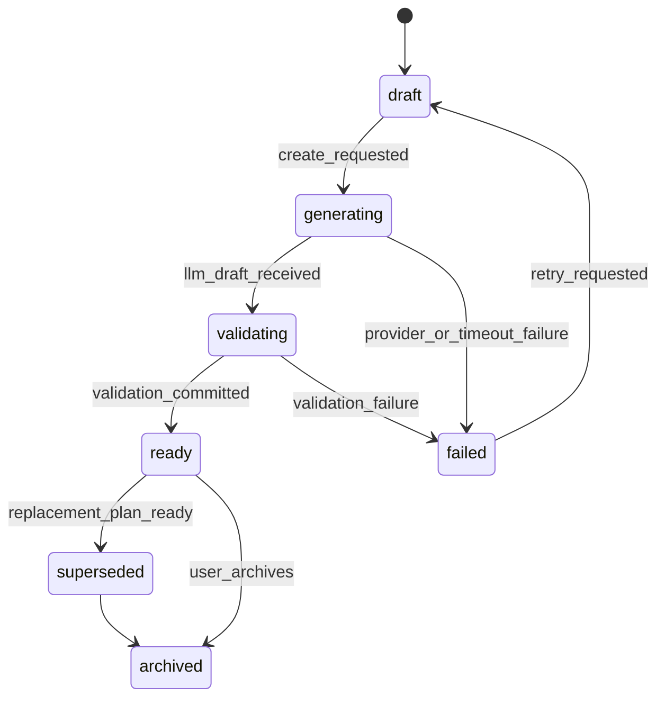
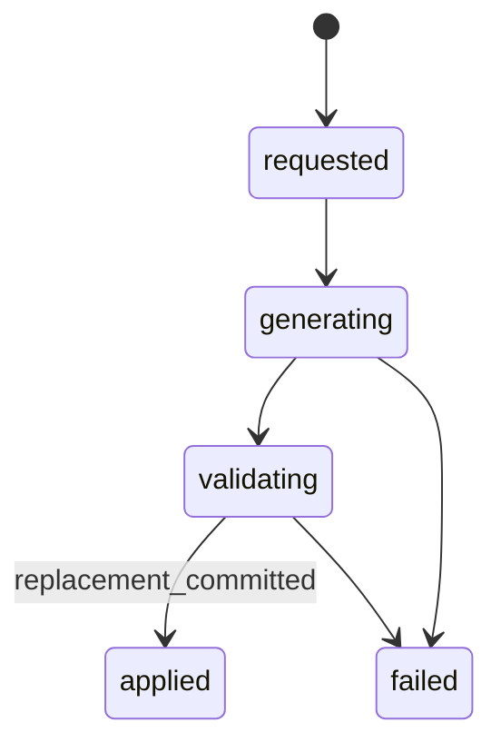

# HealBite Weekly Menu Data Contracts

Status: design-only proposal

## Scope

This document defines proposed Markdown-only contracts for household-aware
weekly meal planning. It does not add migrations, prompt builders, runtime
handlers, or LLM calls.

## Core Entities

### Weekly Meal Plan

Proposed fields:

```text
id
household_id
week_start
timezone
status
generation_version
nutrition_snapshot_version
request_fingerprint
generation_attempt
failure_code
created_by_user_id
created_at
updated_at
finalized_at
archived_at
version
```

Statuses:

```text
draft
generating
validating
ready
failed
superseded
archived
```

### Meal Plan Day

```text
id
weekly_plan_id
local_date
day_index
calculated_nutrition_summary
version
```

### Planned Meal

```text
id
meal_plan_day_id
meal_slot
recipe_version_id
custom_title
status
source
replacement_of_id
created_at
updated_at
version
```

Planned meal state must not be mixed with consumed diary state.

### Member Meal Allocation

```text
id
planned_meal_id
household_member_id
portion_quantity
portion_unit
recipe_yield_fraction
target_calories
calculated_calories
calculated_protein
calculated_fat
calculated_carbs
status
version
```

Authoritative portion representation: `recipe_yield_fraction` plus display
quantity. The fraction is stable for deterministic nutrition math. Display
quantity is retained for UX.

## Recipes

Separate immutable-ish recipe identity from versioned content.

### Recipe

```text
id
household_id nullable
source_type
canonical_title
status
created_by_user_id nullable
created_at
updated_at
version
```

### Recipe Version

```text
id
recipe_id
version_number
title
yield_quantity
yield_unit
instructions_json
nutrition_summary
source_generation_id nullable
created_at
status
```

### Recipe Ingredient

```text
id
recipe_version_id
canonical_food_id nullable
source_name
source_quantity
source_unit
normalized_quantity
normalized_unit
conversion_method
conversion_confidence
preparation_note nullable
sort_order
```

Do not store mutable recipe history as one constantly overwritten JSON blob.

## Canonical Food

Proposed fields:

```text
id
canonical_name
category
base_unit
density nullable
edible_fraction nullable
status
created_at
updated_at
version
```

Aliases may be stored separately. Products must not be automatically merged
only by fuzzy text match.

## Dietary Restrictions

Restriction classes:

- hard allergy;
- medical restriction;
- religious or ethical restriction;
- strong dislike;
- soft preference.

Hard allergies and medical restrictions are deterministic validation inputs.
They are not optional LLM preferences.

## LLM JSON Contract

LLM may propose meal variety, recipes, and replacements. LLM is not source of
truth for KBJU, portions, permissions, idempotency, or DB state.

```json
{
  "type": "object",
  "required": ["plan_days", "recipes"],
  "additionalProperties": false,
  "properties": {
    "plan_days": {
      "type": "array",
      "items": {
        "type": "object",
        "required": ["day_index", "meals"],
        "additionalProperties": false,
        "properties": {
          "day_index": {"type": "integer", "minimum": 0, "maximum": 6},
          "meals": {
            "type": "array",
            "items": {
              "type": "object",
              "required": ["meal_slot", "recipe_ref", "household_allocations"],
              "additionalProperties": false,
              "properties": {
                "meal_slot": {"type": "string", "enum": ["breakfast", "lunch", "dinner", "snack"]},
                "recipe_ref": {"type": "string"},
                "household_allocations": {
                  "type": "array",
                  "items": {
                    "type": "object",
                    "required": ["member_label", "portion_hint"],
                    "additionalProperties": false,
                    "properties": {
                      "member_label": {"type": "string", "pattern": "^(member|dependent)_[0-9]+$"},
                      "portion_hint": {"type": "string"}
                    }
                  }
                }
              }
            }
          }
        }
      }
    },
    "recipes": {
      "type": "array",
      "items": {
        "type": "object",
        "required": ["recipe_ref", "title", "ingredients"],
        "additionalProperties": false,
        "properties": {
          "recipe_ref": {"type": "string"},
          "title": {"type": "string"},
          "ingredients": {"type": "array"}
        }
      }
    }
  }
}
```

Do not persist chain of thought or raw provider response.

## Deterministic Pipeline

```text
LLM draft
→ JSON validation
→ hard restriction validation
→ ingredient resolution
→ nutrition lookup
→ recipe nutrition calculation
→ member portion allocation
→ daily target comparison
→ correction/retry
→ atomic persistence
→ ready plan
```

A plan may become `ready` only after the full successful transaction commits.

## Nutrition Target Snapshot

Plan generation stores the member target versions used for calculation. A later
profile or target change does not silently recalculate old plans. Users may
explicitly regenerate or refresh a plan.

## State Machines

### Weekly Plan



### Meal Replacement



## Idempotency and Concurrency

Use `request_fingerprint`, command `idempotency_key`, generation leases,
generation attempts, optimistic versions, unique constraints, and
compare-and-swap updates. Correlation ID must not be used as the business
idempotency key.

## Transaction Boundaries

Recommended atomic commits:

1. create plan shell and claim generation lease;
2. persist validated recipes, days, meals, allocations, and nutrition summaries;
3. mark plan `ready`;
4. generate or refresh shopping list from ready plan in a separate transaction.

If validation fails, plan remains `failed` with a safe failure code, not partial
ready content.

## Proposed Indexes and Constraints

```sql
CREATE UNIQUE INDEX weekly_plan_active_week
ON weekly_meal_plans(household_id, week_start)
WHERE status IN ('draft', 'generating', 'validating', 'ready');

CREATE UNIQUE INDEX meal_day_index
ON meal_plan_days(weekly_plan_id, day_index);

CREATE INDEX member_allocation_member
ON member_meal_allocations(household_member_id, planned_meal_id);
```

## Observability

Allowed safe markers:

```text
route
feature_state
household_size_bucket
plan_day_count
meal_count_bucket
generation_status
validation_outcome
retry_count_bucket
duration_bucket
provider_error_type
```

Forbidden in logs:

```text
Telegram IDs
household member names
allergies
medical restrictions
exact nutrition targets
meal titles
raw prompts
raw LLM responses
callback payloads
raw exception bodies
```

## Domain Test Matrix

| Scenario | Expected result |
| --- | --- |
| one-member household | plan uses primary member target snapshot |
| two-member household | shared meals get different allocations |
| hard allergy conflict | plan validation fails or retries |
| soft dislike conflict | can be used as ranking preference |
| meal replacement | only selected meal changes |
| provider timeout | no partial ready plan |
| double create click | one logical plan or idempotent response |
| concurrent replacement | one compare-and-swap winner |
| target changes after plan | old plan keeps snapshot |
| diary integration | planned meal does not auto-log consumed food |
